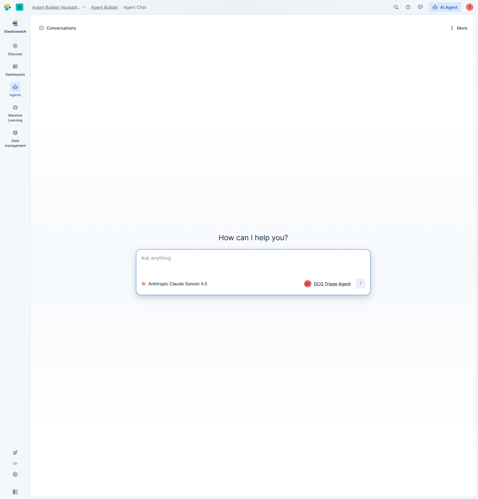

# How This Project Uses Elastic Agent Builder

> **DCO Threat Triage Agent** — an autonomous AI agent built entirely on Elastic Agent Builder for the Elasticsearch Agent Builder Hackathon.

---

## 1. Overview

This project uses **Elastic Agent Builder** as its core AI engine. The DCO (Defensive Cyberspace Operations) Threat Triage Agent is a **custom agent** with **7 custom tools** that performs autonomous first-pass security alert triage by:

- Correlating security events with **ES|QL** queries
- Hunting for attack patterns (lateral movement, C2 beaconing, process chains)
- Cross-referencing **MITRE ATT&CK-mapped threat intelligence**
- Triggering automated **incident triage workflows**
- Generating structured triage reports with severity scoring

Everything is created programmatically via the **Kibana REST API** and operates through the **Agent Builder converse API**.

---

## 2. Custom Agent: DCO Triage Agent


*Kibana Agent Builder Agents page showing the custom DCO Triage Agent alongside the built-in Elastic AI Agent.*


*DCO Triage Agent configuration page showing Agent ID (`dco_triage_agent`), display name, system prompt, and Settings/Tools tabs.*

### Agent Details

| Field | Value |
|-------|-------|
| **Agent ID** | `dco_triage_agent` |
| **Display Name** | DCO Triage Agent |
| **LLM Model** | Anthropic Claude Sonnet 4.5 (via Elastic inference connector) |
| **Tools Wired** | 7 custom tools (5 ES\|QL + 1 Search + 1 Workflow) |
| **Created Via** | `POST /api/agent_builder/agents` ([setup_agent_builder.py](setup_agent_builder.py)) |

### 6-Step Triage Methodology (System Prompt)

The agent's description contains a detailed system prompt that defines a structured reasoning chain:

1. **Initial Correlation** — Use `correlated_events_by_ip` to build a chronological timeline
2. **Threat Intel Enrichment** — Use `threat_intel_lookup` to check IPs, domains, and hashes against the IOC database
3. **Attack Pattern Detection** — Use `beaconing_detection` and `lateral_movement_detection` to identify C2 and credential abuse
4. **Process Forensics** — Use `process_chain_analysis` to inspect suspicious process trees
5. **Severity Assessment** — Score P1 (Critical) through P4 (Low) using defined rubric
6. **Triage Report** — Generate structured output with MITRE ATT&CK mapping, affected assets, and containment recommendations

---

## 3. Custom Tools (7 Total)


*The Tools tab on the DCO agent showing all 7 active tools with the "Show active only" toggle enabled. The green status bar shows 7/24 tools active.*


*Kibana Agent Builder Tools page showing the full inventory — 7 custom tools (beaconing_detection, correlated_events_by_ip, incident_triage_workflow, lateral_movement_detection, privilege_escalation_detection, process_chain_analysis, threat_intel_lookup) alongside 11 built-in platform tools.*

### Tool Inventory

| # | Tool ID | Type | Purpose | Parameters |
|---|---------|------|---------|------------|
| 1 | `correlated_events_by_ip` | **ES\|QL** | Build event timeline by source IP within 24h window | `source_ip` (string) |
| 2 | `lateral_movement_detection` | **ES\|QL** | Detect multi-host auth events indicating credential abuse | None (auto-scan) |
| 3 | `beaconing_detection` | **ES\|QL** | Identify C2 communication with periodic outbound connections | None (auto-scan) |
| 4 | `process_chain_analysis` | **ES\|QL** | Forensic parent-child process trees on a host | `hostname` (string) |
| 5 | `privilege_escalation_detection` | **ES\|QL** | Flag high-severity event clusters indicating privilege escalation | None (auto-scan) |
| 6 | `threat_intel_lookup` | **index_search** | Cross-reference IOCs against the `threat-intel` index (18 MITRE-mapped IOCs) | Natural language query |
| 7 | `incident_triage_workflow` | **workflow** | Trigger automated incident triage — creates incident record, assigns severity, generates containment recommendations | Workflow parameters |

### Tool Type Breakdown

- **5 ES|QL tools** — Each contains a parameterized ES|QL query that the agent executes against the `security-alerts` index (105 events). Queries use `?param_name` syntax for secure parameter binding.
- **1 index_search tool** — Performs hybrid keyword + semantic search against the `threat-intel` index containing 18 IOCs mapped to MITRE ATT&CK techniques.
- **1 workflow tool** — Triggers an Elastic Workflow (UUID: `workflow-d576883d-4b80-4722-8ab6-41770d6a1cd3`) that creates formal incident records in the `incident-log` index.

### Example ES|QL Query (beaconing_detection)

```sql
FROM security-alerts
| WHERE event.category == "network"
  AND network.direction == "outbound"
  AND @timestamp >= NOW() - 24 HOURS
| STATS beacon_count = COUNT(*), total_bytes = SUM(source.bytes),
        first_seen = MIN(@timestamp), last_seen = MAX(@timestamp)
  BY destination.ip, destination.domain, source.ip
| WHERE beacon_count >= 5
| EVAL duration_minutes = DATE_DIFF("minutes", first_seen, last_seen)
| EVAL avg_interval_seconds = CASE(
    beacon_count > 1,
    duration_minutes * 60.0 / (beacon_count - 1), 0)
| WHERE avg_interval_seconds > 0 AND avg_interval_seconds < 600
| SORT beacon_count DESC
| LIMIT 20
```

---

## 4. Programmatic Setup via Kibana REST API

All Agent Builder resources are created programmatically by [`setup_agent_builder.py`](setup_agent_builder.py). No manual Kibana UI configuration is required.

### API Calls Made

```
# Create 5 ES|QL tools
POST /api/agent_builder/tools  ×5  (type: "esql")

# Create 1 Search tool
POST /api/agent_builder/tools      (type: "index_search")

# Create 1 Workflow tool
POST /api/agent_builder/tools      (type: "workflow")

# Create the DCO Triage Agent wired to all 7 tools
POST /api/agent_builder/agents     (configuration.tools: [{tool_ids: [...]}])
```

### Upsert Logic

The script uses **idempotent upsert**: it POSTs first, and if a tool/agent already exists (HTTP 400 "already exists"), it falls back to PUT with `id` and `type` stripped from the body. This makes the setup safe to run repeatedly.

### Authentication

```python
headers = {
    "Authorization": f"ApiKey {api_key}",
    "Content-Type": "application/json",
    "kbn-xsrf": "true",
}
```

---

## 5. Frontend Integration (Converse API)

The Next.js frontend at [`frontend/app/api/chat/route.ts`](frontend/app/api/chat/route.ts) proxies user messages to the Agent Builder **converse API**.

### Request Flow

```
User → Frontend Chat UI → POST /api/chat (Next.js route)
  → POST {kibana}/api/agent_builder/converse
    → Agent Builder orchestrates tool calls
    → Returns response + tool_calls + conversation_id
  ← Frontend displays response with backend badge + execution trace
```

### Converse API Call

```typescript
const res = await fetch(`${kibanaUrl}/api/agent_builder/converse`, {
  method: "POST",
  headers: {
    "Content-Type": "application/json",
    Authorization: `ApiKey ${apiKey}`,
    "kbn-xsrf": "true",
    "x-elastic-internal-origin": "Kibana",
  },
  body: JSON.stringify({
    input: lastUserMsg.content,
    agent_id: "dco_triage_agent",
    conversation_id: conversationId,  // multi-turn context
  }),
});
```

### Response Processing

The frontend extracts:
- **`response`** — The agent's text analysis
- **`steps`** — Array of `{type, tool_id, reasoning, params, results}` for the execution trace
- **`toolsUsed`** — List of tool IDs called during the conversation
- **`conversation_id`** — For multi-turn conversation context
- **`backend: "agent_builder"`** — Displayed as a badge in the UI

### Fallback Architecture

If Agent Builder is unavailable, the chat route falls back to a Groq-powered implementation that mirrors the same tool set using direct ES|QL queries. The UI shows which backend powered each response ("AGENT BUILDER" vs "GROQ" badge).

---

## 6. Live Demo — Agent Chat


*Kibana Agent Chat with DCO Triage Agent selected, powered by Anthropic Claude Sonnet 4.5. The chat input is ready for a triage query.*


*The "Meet your active agent" tooltip confirming DCO Triage Agent is the active agent in the Agent Builder chat.*

### Frontend Chat Integration


*The Next.js frontend Agent Chat page showing all 7 tool badges (Correlated Events, Lateral Movement, Beaconing Detection, Process Chain, Privilege Escalation, Threat Intel, Incident Workflow) and the "AGENT BUILDER" backend indicator.*

### What Happens When You Ask "Investigate 10.10.15.42"

1. The agent calls `correlated_events_by_ip(source_ip="10.10.15.42")` — finds 34 events across 5 MITRE ATT&CK stages
2. The agent calls `threat_intel_lookup("10.10.15.42")` — matches C2 server IOC at `198.51.100.23`
3. The agent calls `beaconing_detection()` — detects ~345-second beacon interval to `198.51.100.23`
4. The agent calls `lateral_movement_detection()` — finds credential abuse across 4 victim hosts
5. The agent calls `process_chain_analysis(hostname="WS-PC0142")` — reveals `EXCEL.EXE → cmd.exe → powershell.exe` chain
6. The agent generates a **P1 CRITICAL** triage report with MITRE ATT&CK mapping and containment recommendations

---

## 7. Architecture


*The frontend dashboard showing the Elastic Agent Builder connection status, 7 tool badges, and the architecture diagram showing how Agent Builder sits at the center — connecting to 3 Elasticsearch indices via 7 specialized tools.*

### Architecture Flow

```
┌─────────────────────────────────────────────────────────────┐
│                    ELASTIC AGENT BUILDER                     │
│                                                              │
│  ┌──────────────────────┐    ┌────────────────────────────┐ │
│  │   DCO Triage Agent   │    │   7 Custom Tools           │ │
│  │   (Claude Sonnet 4.5)│───▶│   5× ES|QL queries        │ │
│  │                      │    │   1× index_search          │ │
│  │   6-step reasoning   │    │   1× workflow              │ │
│  └──────────────────────┘    └────────────┬───────────────┘ │
│                                           │                  │
└───────────────────────────────────────────┼──────────────────┘
                                            │
                    ┌───────────────────────┼───────────────────┐
                    │                       │                   │
              ┌─────▼──────┐    ┌──────────▼──┐    ┌──────────▼──┐
              │ security-  │    │  threat-    │    │  incident-  │
              │ alerts     │    │  intel      │    │  log        │
              │ (105 docs) │    │  (18 IOCs)  │    │  (incidents)│
              └────────────┘    └─────────────┘    └─────────────┘
                    │                                      ▲
                    │           Elasticsearch               │
                    └──────────────────────────────────────┘
```

### Data Pipeline

1. **`create_indices.py`** — Creates 3 ECS-compatible index mappings
2. **`load_attack_data.py`** — Loads a 5-stage MITRE ATT&CK kill chain (34 attack events + 71 noise events)
3. **`load_threat_intel.py`** — Loads 18 IOCs mapped to MITRE techniques
4. **`setup_agent_builder.py`** — Creates 7 tools + 1 agent via Kibana REST API
5. **Frontend** — Next.js dashboard proxies to Agent Builder converse API

---

## 8. Key Evidence of Agent Builder Usage

| Evidence | Location |
|----------|----------|
| Custom agent created via REST API | `setup_agent_builder.py:373-415` |
| 7 custom tools created via REST API | `setup_agent_builder.py:272-370` |
| Frontend calls converse API | `frontend/app/api/chat/route.ts:52-62` |
| Agent visible in Kibana UI | `screenshots/demo/agent-builder-agents-list.png` |
| 7 tools visible in agent config | `screenshots/demo/agent-builder-dco-tools.png` |
| Chat powered by Agent Builder | `screenshots/demo/agent-builder-chat-ready.png` |
| Backend badge shows "AGENT BUILDER" | `screenshots/demo/chat.png` |
| ES|QL queries in tool definitions | `setup_agent_builder.py:69-165` |
| Workflow tool with UUID | `setup_agent_builder.py:182-190` |
| Multi-turn conversation support | `frontend/app/api/chat/route.ts:44-49` |

---

## 9. Demo Video Script (3-Minute Guide)

### Shot 1: The Problem (0:00–0:20)
- Show the **Dashboard** page with 105 security alerts, 5 critical threats, 8 high-severity alerts
- Narrate: *"Security teams are overwhelmed with alerts. Our DCO Triage Agent uses Elastic Agent Builder to perform autonomous first-pass triage."*

### Shot 2: Agent Builder in Kibana (0:20–0:50)
- Navigate to **Agents** page → show DCO Triage Agent in the list
- Click into the agent → show **Settings** tab (Agent ID, system prompt)
- Click **Tools** tab → show all 7 active tools with descriptions
- Navigate to **Tools** page → show the full tool inventory
- Narrate: *"We created a custom agent with 7 specialized tools — 5 ES|QL queries for threat hunting, 1 search tool for threat intel, and 1 workflow tool for incident documentation. All created programmatically via the Kibana REST API."*

### Shot 3: Live Triage Demo (0:50–1:30)
- In Kibana Agent Chat, type: **"Investigate suspicious activity from 10.10.15.42"**
- Show the agent calling tools in sequence (correlated_events → threat_intel → beaconing → lateral_movement → process_chain)
- Show the structured triage report output with MITRE ATT&CK mapping
- Narrate: *"Watch the agent autonomously correlate events, check threat intel, detect C2 beaconing, identify lateral movement, and generate a P1 Critical triage report — all using Agent Builder tools."*

### Shot 4: Frontend Dashboard (1:30–2:00)
- Switch to the **Next.js frontend** at the deployed Vercel URL
- Show the Dashboard with kill chain visualization and architecture diagram
- Show the **Agent Chat** page with 7 tool badges and "AGENT BUILDER" backend badge
- Send a query and show the execution trace panel
- Narrate: *"The frontend integrates directly with Agent Builder via the converse API, showing real-time tool execution traces and backend attribution."*

### Shot 5: Code Walkthrough (2:00–2:30)
- Show `setup_agent_builder.py` — the programmatic tool and agent creation
- Show `frontend/app/api/chat/route.ts` — the converse API proxy
- Narrate: *"Everything is code-driven. setup_agent_builder.py creates all 7 tools and the agent via REST API. The frontend proxies to the converse API for real-time agent interactions."*

### Shot 6: Architecture & Wrap Up (2:30–3:00)
- Show the architecture diagram from the dashboard
- Highlight: 3 Elasticsearch indices → 7 Agent Builder tools → 1 custom agent → frontend
- Narrate: *"The DCO Triage Agent demonstrates Agent Builder's power for security operations — combining ES|QL, search, and workflow tools into an autonomous triage pipeline. Thank you!"*

---

## Repository Structure

```
elastic-hackathon/
├── setup_agent_builder.py      # Creates 7 tools + 1 agent via Kibana REST API
├── create_indices.py           # 3 ECS-compatible index mappings
├── load_attack_data.py         # 5-stage MITRE ATT&CK attack chain + noise
├── load_threat_intel.py        # 18 MITRE-mapped IOCs
├── es_client.py                # Elasticsearch connection factory
├── test_agent.py               # End-to-end test suite
├── frontend/
│   ├── app/api/chat/route.ts   # Agent Builder converse API proxy
│   ├── app/dashboard/          # Security dashboard
│   ├── app/chat/               # Agent chat page
│   ├── lib/elasticsearch.ts    # ES client
│   └── lib/queries.ts          # ES|QL query definitions
└── screenshots/demo/           # All screenshots referenced in this document
```
