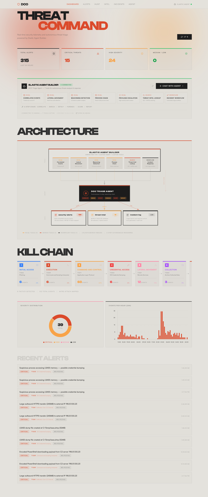
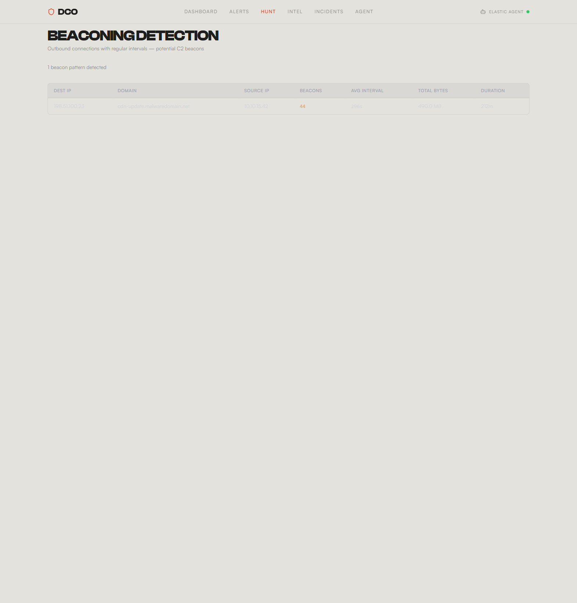
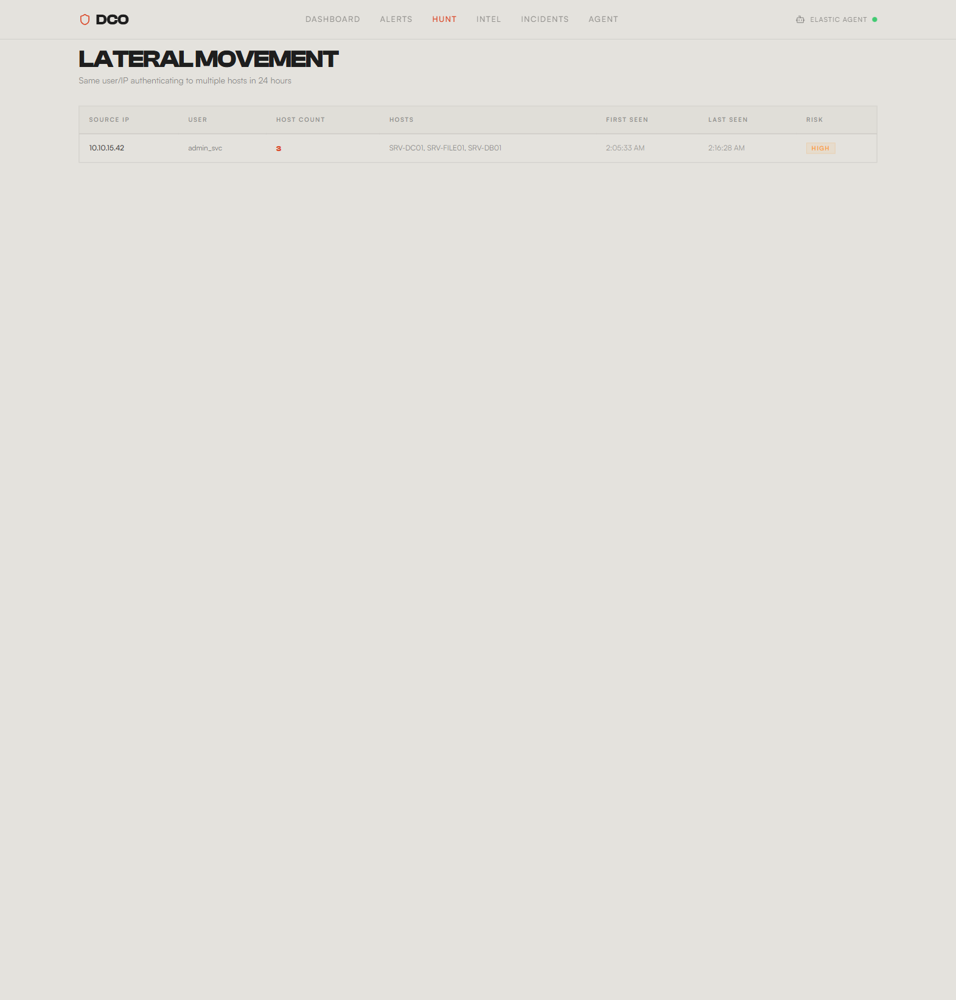
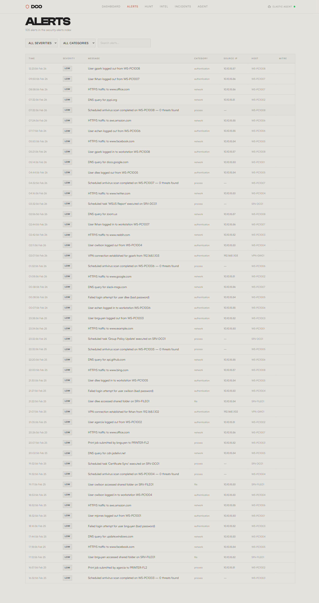
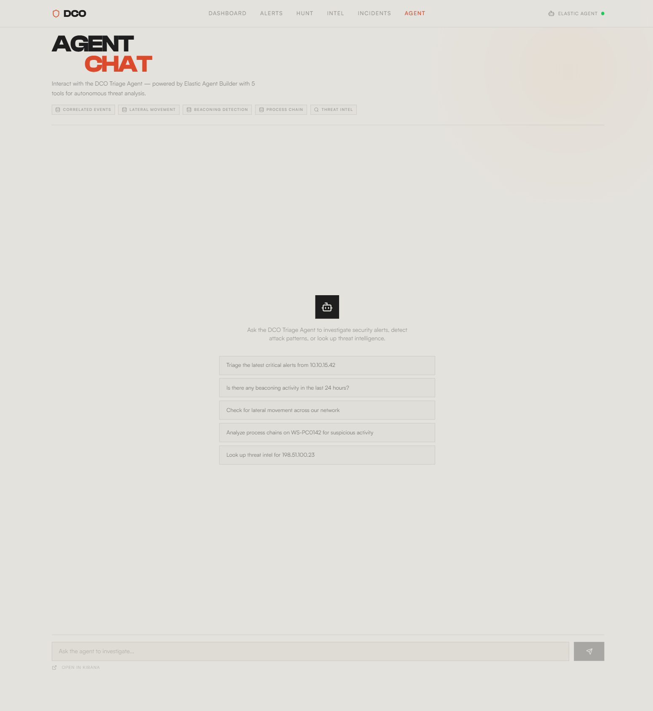

# DCO Threat Triage Agent

> **Elasticsearch Agent Builder Hackathon Submission**
> 30-minute manual triage. 30-second AI analysis. Same analyst-grade results.

**DCO Threat Triage Agent** is an autonomous AI agent built entirely with **Elastic Agent Builder** that performs first-pass security alert triage — correlating events with ES|QL, hunting for attack patterns, and cross-referencing MITRE ATT&CK-mapped threat intelligence — so SOC analysts can focus on confirmed threats instead of drowning in noise.

**[Live Dashboard](https://frontend-drab-xi-56.vercel.app/dashboard)** | **[Devpost Submission](https://devpost.com/software/dco-threat-triage-agent)**

---

## Demo

<p align="center">
  
</p>

---

## Problem

**68% of SOC analysts report alert fatigue** (Panther Labs, 2024). Security teams receive thousands of alerts every day. Each one demands the same manual workflow: correlate related events, look up threat intelligence, trace process chains, assess severity, and decide what to escalate. Most alerts turn out to be false positives — but the one that isn't can mean a breach. When analysts are buried in noise, real attacks slip through. The problem is not detection. It is triage at scale.

## Solution

**DCO Threat Triage Agent** automates the entire first-pass triage workflow using **seven purpose-built tools** orchestrated by Elastic Agent Builder:

1. **Event Correlation** (ES|QL) — Links related alerts by source IP, timeframe, and host across the full event timeline
2. **Beaconing Detection** (ES|QL) — Identifies periodic C2 callback patterns using time-bucketed aggregation
3. **Lateral Movement Detection** (ES|QL) — Traces credential use and SMB connections across multiple hosts
4. **Process Chain Analysis** (ES|QL) — Reconstructs parent-child process trees to reveal execution chains
5. **Privilege Escalation Detection** (ES|QL) — Detects suspicious privilege changes and token manipulation across hosts
6. **Threat Intel Lookup** (Search) — Cross-references IOCs against a MITRE ATT&CK-mapped database using hybrid semantic + keyword search
7. **Incident Workflow** (Workflow) — Automatically logs triage results, severity scores, and containment recommendations to the incident log

The agent chains these tools in a **6-step reasoning loop** (Correlate, Enrich, Detect, Forensic Analysis, Score, Report), then generates a structured triage report with MITRE ATT&CK kill chain mapping, severity scoring, and specific containment recommendations.

To prove it works, we built a realistic simulated environment: a **5-stage attack chain** (phishing, PowerShell C2, credential dumping, lateral movement, data exfiltration) buried in **80+ benign noise events**. The agent finds the needle in the haystack — every time.

---

## Agent Builder in Kibana

The agent and all 7 tools are deployed in Elastic Agent Builder and accessible via the Kibana UI:

<p align="center">
  
</p>

<p align="center">
  
</p>

---

## Dashboard

The real-time security operations dashboard shows alert statistics, severity distribution, event timeline, and MITRE ATT&CK kill chain visualization — all querying live Elasticsearch data.

<p align="center">
  
</p>

---

## Threat Hunting

Four specialized hunt views powered by ES|QL queries:

### Event Correlation
Links related alerts by source IP across the full event timeline.

<p align="center">
  
</p>

### Beaconing Detection
Identifies periodic C2 callback patterns using time-bucketed aggregation.

<p align="center">
  
</p>

### Lateral Movement
Traces credential use and SMB connections across multiple hosts.

<p align="center">
  
</p>

### Process Chain Analysis
Reconstructs parent-child process trees to reveal execution chains.

<p align="center">
  
</p>

---

## Alerts & Threat Intel

<p align="center">
  
</p>

<p align="center">
  
</p>

---

## Agent Chat

Send natural language prompts to the DCO Triage Agent. It autonomously selects which tools to call, correlates the results, and returns a structured triage report.

<p align="center">
  
</p>

---

## Incidents

Agent-generated triage reports with MITRE ATT&CK kill chain mapping, severity scores, and containment recommendations.

<p align="center">
  
</p>

---

## Architecture

```
┌──────────────────────────────────────────────────────────────┐
│                    Elastic Agent Builder                       │
│                                                               │
│  ┌─────────────────┐  ┌──────────────┐  ┌────────────────┐  │
│  │  ES|QL Tools (5) │  │ Search Tool  │  │ Workflow Tool  │  │
│  │                  │  │              │  │                │  │
│  │ • Correlation    │  │ • IOC Lookup │  │ • Incident     │  │
│  │ • Beaconing      │  │   (Hybrid    │  │   Logging &    │  │
│  │ • Lateral Move   │  │   Semantic + │  │   Severity     │  │
│  │ • Process Chain  │  │   Keyword)   │  │   Scoring      │  │
│  │ • Priv Escalation│  │              │  │                │  │
│  └────────┬─────────┘  └──────┬───────┘  └───────┬────────┘  │
│           │                   │                   │           │
│           └───────────────────┼───────────────────┘           │
│                               │                               │
│                  ┌────────────▼────────────┐                  │
│                  │      Agent Brain        │                  │
│                  │  6-Step Reasoning Chain: │                  │
│                  │  Correlate → Enrich →   │                  │
│                  │  Detect → Forensic →    │                  │
│                  │  Score → Report         │                  │
│                  └─────────────────────────┘                  │
└──────────────────────────────────────────────────────────────┘
                               │
            ┌──────────────────┼──────────────────┐
            ▼                  ▼                  ▼
   ┌─────────────────┐ ┌─────────────┐ ┌──────────────────┐
   │  security-alerts │ │ threat-intel │ │  incident-log    │
   │  (~105 events)   │ │  (18 IOCs)   │ │  (triage reports)│
   │   ECS-mapped     │ │ MITRE ATT&CK │ │  auto-generated  │
   └─────────────────┘ └─────────────┘ └──────────────────┘
```

## Tech Stack

| Component | Technology |
|---|---|
| Agent Platform | Elastic Agent Builder |
| Data Store | Elasticsearch (Cloud Serverless) |
| Query Language | ES\|QL |
| Search | Hybrid / Semantic Search |
| Threat Framework | MITRE ATT&CK |
| Dashboard | Next.js 14 + TypeScript + Tailwind CSS |
| Charts | Recharts |
| Languages | Python 3.11+, TypeScript 5.7 |

---

## Setup

### Prerequisites

- Python 3.11+
- An [Elastic Cloud](https://cloud.elastic.co/registration?cta=agentbuilderhackathon) account

### Installation

```bash
# Clone the repository
git clone https://github.com/TimothyVang/elastic-hackathon.git
cd elastic-hackathon

# Install dependencies
pip install -r requirements.txt

# Configure environment variables
cp .env.example .env
# Edit .env with your credentials
```

### Environment Variables

| Variable | Required | Description |
|---|---|---|
| `ELASTIC_CLOUD_ID` | Yes | Your Elastic Cloud deployment ID |
| `ELASTIC_API_KEY` | Yes | Elasticsearch API key |
| `ELASTICSEARCH_URL` | Alt | Direct Elasticsearch URL (if not using Cloud ID) |
| `KIBANA_URL` | Yes | Kibana URL (for Agent Builder API) |

### Quick Start

```bash
# 1. Verify Elasticsearch connectivity
python es_client.py

# 2. Create index mappings
python create_indices.py

# 3. Load simulated attack chain + noise events (~105 events)
python load_attack_data.py

# 4. Load threat intelligence IOCs (~18 IOCs)
python load_threat_intel.py

# 5. Set up Agent Builder tools + agent in Kibana
python setup_agent_builder.py

# 6. Run end-to-end tests
python test_agent.py              # Full test (data + agent)
python test_agent.py --data-only  # Data + ES|QL queries only
```

### Running the Dashboard

```bash
cd frontend
npm install
cp .env.local.example .env.local  # Or edit .env.local with your ES credentials
npm run dev                        # → http://localhost:3000
```

The dashboard requires the same Elasticsearch credentials as the backend. Set these in `frontend/.env.local`:
- `ELASTICSEARCH_URL` or `ELASTIC_CLOUD_ID`
- `ELASTIC_API_KEY`
- `KIBANA_URL` (optional, for Agent Chat)

---

## Features We Liked

- **ES|QL for threat hunting is a game-changer** -- ES|QL's pipe-based syntax is incredibly natural for security analysts. Writing correlated event queries felt like writing SPL or KQL but with better performance. The ability to parameterize queries and expose them as Agent Builder tools means any ES|QL query can become an autonomous capability.
- **Agent Builder's tool orchestration** -- Wiring up ES|QL, Search, and Workflow tools into a single agent was straightforward and powerful. The agent autonomously decides which tool to call next based on what it learned from the previous one -- that reasoning chain is what elevates this from a dashboard into a true triage agent.
- **Hybrid search for threat intel** -- Combining keyword and semantic search for IOC lookup means the agent can find related threats even when exact indicators don't match. A query for "credential dumping" surfaces LSASS-related IOCs alongside hash-based matches, giving the agent broader threat context.

## Challenges

- **Realistic attack simulation** -- Designing a 5-stage MITRE ATT&CK attack chain buried in 80+ benign noise events that demonstrates the agent's pattern-finding capabilities without being trivially solvable required careful calibration of event timestamps, severities, and process trees.
- **Agent Builder API integration** -- Programmatically creating ES|QL tools, search tools, and workflow tools via the Kibana REST API required careful payload construction (named vs. positional params, upsert logic with POST/PUT fallback) and thorough testing against the Agent Builder endpoints.
- **ES|QL query design at scale** -- Tuning beaconing detection thresholds (e.g., `avg_interval_seconds < 600`) and time-bucketed aggregations to be both performant and accurate across time-series data required multiple iterations of testing against realistic event volumes.

## License

This project is licensed under the MIT License — see the [LICENSE](LICENSE) file for details.

## Links

- [Devpost Submission](https://devpost.com/software/dco-threat-triage-agent)
- [Live Dashboard](https://frontend-drab-xi-56.vercel.app/dashboard)
- [Elasticsearch Agent Builder Hackathon](https://elasticsearch.devpost.com)
- [Elastic Agent Builder Docs](https://www.elastic.co/docs/explore-analyze/ai-features/elastic-agent-builder)
- [Elastic Cloud Registration](https://cloud.elastic.co/registration?cta=agentbuilderhackathon)
- [MITRE ATT&CK Framework](https://attack.mitre.org/)

---

*Built for the Elasticsearch Agent Builder Hackathon by [TimothyVang](https://github.com/TimothyVang)*
