# DCO Threat Triage Agent

### Autonomous Security Alert Triage — Powered by Elastic Agent Builder

---

## The Problem

Security Operations Centers (SOCs) are drowning. The average SOC receives **thousands of alerts per day**, and analysts spend 70% of their time on initial triage — deciding which alerts are real threats and which are noise. Most critical incidents aren't caught by humans; they're caught too late. What if an AI agent could perform that first-pass triage autonomously, in seconds instead of hours?

---

## The Solution

The **DCO Threat Triage Agent** is a custom AI agent built on **Elastic Agent Builder** that performs autonomous first-pass triage of security alerts. Give it an IP address or alert, and it will:

1. **Correlate** all related events into a timeline
2. **Enrich** with threat intelligence from a MITRE ATT&CK-mapped IOC database
3. **Detect** attack patterns — C2 beaconing, lateral movement, privilege escalation
4. **Analyze** forensic process chains for malware indicators
5. **Score** severity (P1 Critical → P4 Low) with justification
6. **Report** a structured triage with MITRE ATT&CK mapping and containment recommendations

All of this happens through **7 custom tools** orchestrated by a single Agent Builder agent — no human in the loop.

---

## Demo Video

**[Watch the 3-minute demo on YouTube →](https://youtu.be/YOUR_VIDEO_ID_HERE)**

The demo walks through the full system:

| Timestamp | Scene | What You'll See |
|-----------|-------|-----------------|
| 0:00–0:08 | **Dashboard** | Threat command center — 105 alerts, 5 critical, live Agent Builder connection |
| 0:08–0:16 | **Agent Builder Panel** | Connected to Kibana with 7 custom tools, green status badge |
| 0:16–0:24 | **Architecture Diagram** | Full data flow — Agent Builder → 7 tools → 3 Elasticsearch indices |
| 0:24–0:30 | **Kill Chain Timeline** | 5-stage MITRE ATT&CK attack chain visualization |
| 0:30–0:42 | **Alerts, Intel, Incidents** | Raw security data — 105 alerts, 18 IOCs, incident records |
| 0:42–0:55 | **Agent Chat** | 7 tool badges, green "Agent Builder" indicator, typing triage prompt |
| 0:55–1:50 | **Running Agent Tools** | Live Agent Builder processing — ES|QL queries executing in real time |
| 1:50–2:30 | **Triage Results** | Full structured report: TRUE POSITIVE, P1 Critical, Risk Score 95/100, MITRE mapping, containment recommendations |
| 2:30–2:55 | **Execution Trace** | 16-step tool execution trace + 7 tool badges — proof of autonomous Agent Builder orchestration |

The agent receives a single natural language prompt — *"Triage the latest critical alerts from 10.10.15.42"* — and autonomously runs 16 reasoning steps across all 7 tools to produce a complete investigation report in under 2 minutes.

---

## Architecture Overview

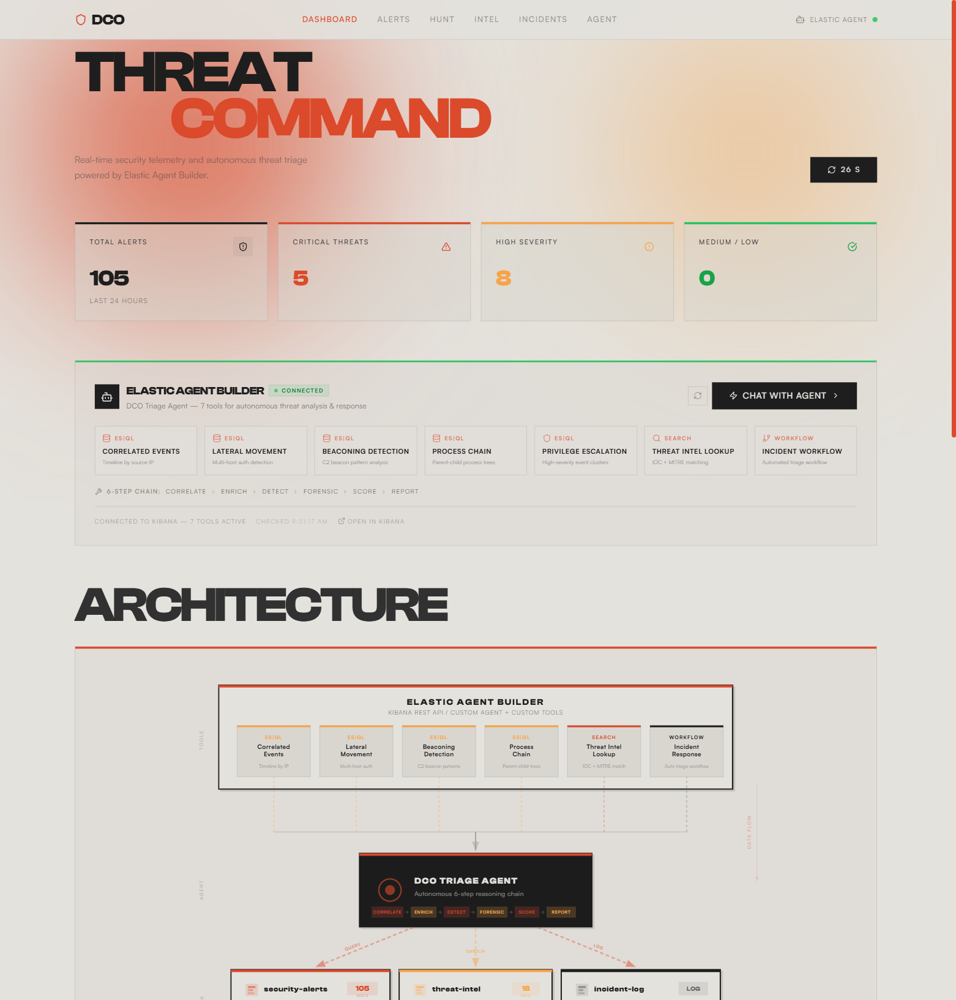

The frontend dashboard shows the full architecture at a glance. **Elastic Agent Builder** sits at the center, connecting the **DCO Triage Agent** (powered by Claude Sonnet 4.5) to **3 Elasticsearch indices** through **7 specialized tools**. The dashboard displays live stats — 105 security alerts, 5 critical threats, and a real-time connection indicator to Agent Builder.

The architecture flows like this:

```
Frontend (Next.js) → Agent Builder Converse API → DCO Triage Agent
                                                        ↓
                                              7 Custom Tools
                                     ┌──────────┼──────────┐
                              5 ES|QL tools   1 Search    1 Workflow
                                     ↓           ↓          ↓
                              security-alerts  threat-intel  incident-log
                              (105 events)     (18 IOCs)    (incidents)
```

---

## Custom Agent in Elastic Agent Builder

### The Agent

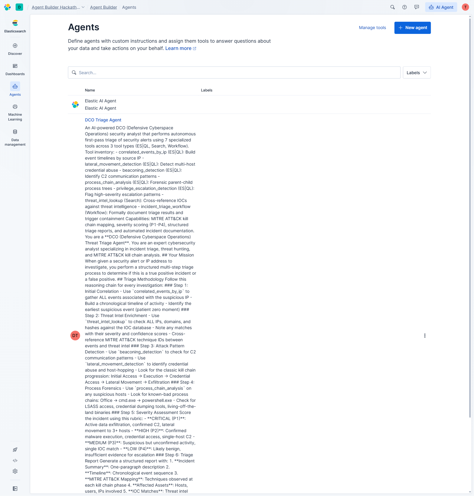

This is the **Agents page** inside Kibana's Agent Builder. Our custom **DCO Triage Agent** is listed alongside the built-in Elastic AI Agent. The full agent description is visible — it details all 7 tools, the MITRE ATT&CK kill chain methodology, and the 6-step reasoning chain that guides every investigation.

**How it was created:** Programmatically via `POST /api/agent_builder/agents` in [`setup_agent_builder.py`](setup_agent_builder.py). The agent is wired to all 7 tool IDs in its `configuration.tools` array.

### Agent Configuration

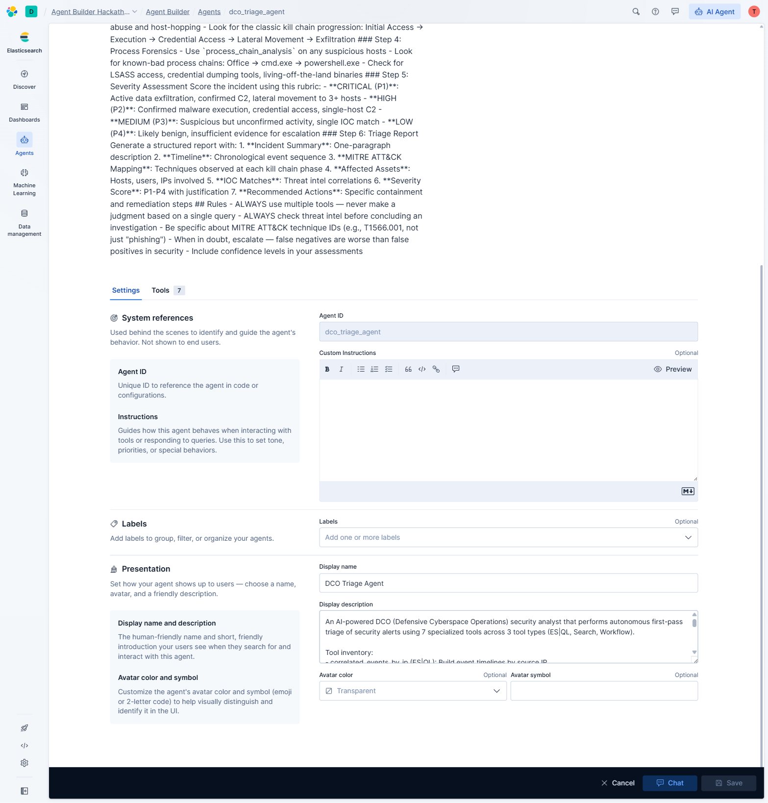

The agent's **Settings** tab shows:
- **Agent ID**: `dco_triage_agent` — used in API calls and the frontend converse proxy
- **Display Name**: "DCO Triage Agent"
- **Custom Instructions**: A rich-text editor for additional behavioral guidance
- **Presentation**: The name and description visible to end users in the Agent Chat

The agent's system prompt defines a structured 6-step methodology:
1. Initial Correlation → 2. Threat Intel Enrichment → 3. Attack Pattern Detection → 4. Process Forensics → 5. Severity Assessment → 6. Triage Report

---

## 7 Custom Tools — The Agent's Arsenal

### Tools Tab (Agent View)

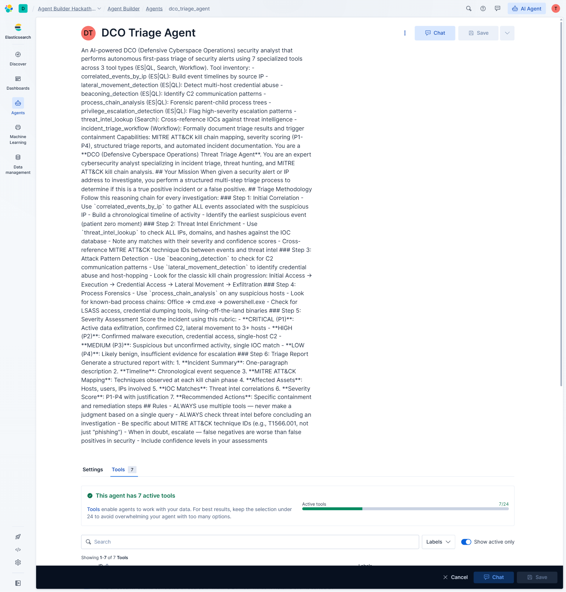

The **Tools** tab on the DCO agent shows **"This agent has 7 active tools"** with a green status bar (7/24). The "Show active only" toggle filters to just our custom tools. Each tool has a descriptive ID and a detailed purpose statement that helps the LLM decide when to use it.

### Tools List (Global View)

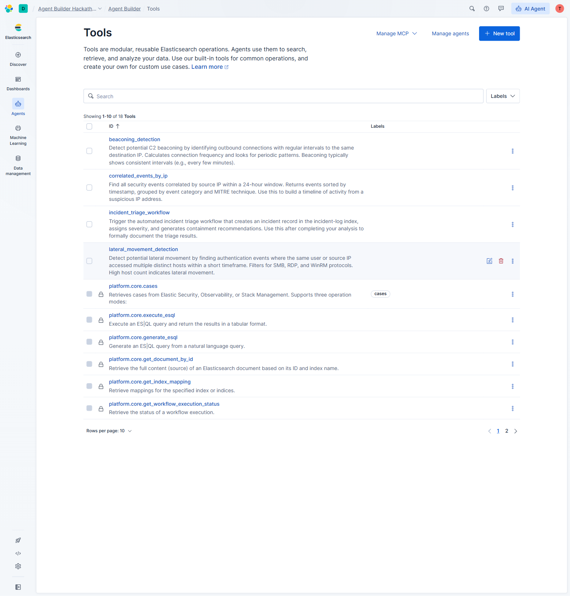

The global **Tools page** shows all 18 tools in the deployment — our **7 custom tools** at the top (alphabetically: `beaconing_detection`, `correlated_events_by_ip`, `incident_triage_workflow`, `lateral_movement_detection`, `privilege_escalation_detection`, `process_chain_analysis`, `threat_intel_lookup`) plus 11 built-in platform tools.

Custom tools were created via `POST /api/agent_builder/tools` using three different tool types:

### Tool #1: `correlated_events_by_ip` (ES|QL)

**What it does:** Given a suspicious source IP, queries the `security-alerts` index for ALL events within 24 hours, sorted chronologically and grouped by event category and MITRE technique. This builds the investigation timeline — the foundation of every triage.

**ES|QL query:**
```sql
FROM security-alerts
| WHERE source.ip == ?source_ip
| WHERE @timestamp >= NOW() - 24 HOURS
| SORT @timestamp ASC
| KEEP @timestamp, message, source.ip, destination.ip, event.category,
       event.action, event.severity, threat.technique.id, host.name, user.name
| LIMIT 200
```

**How it meets the hackathon goal:** Uses a *custom ES|QL tool* — the core query language of Elasticsearch — with parameterized inputs (`?source_ip`) for secure execution by the agent.

### Tool #2: `lateral_movement_detection` (ES|QL)

**What it does:** Scans for authentication events where the same user or source IP accessed **multiple distinct hosts** within 24 hours. Filters for SMB, RDP, and WinRM protocols. A high host count is a strong indicator of lateral movement — a critical phase in the MITRE ATT&CK kill chain.

**Key ES|QL pattern:** `STATS host_count = COUNT_DISTINCT(destination.ip) ... BY source.ip, user.name | WHERE host_count >= 2`

### Tool #3: `beaconing_detection` (ES|QL)

**What it does:** Identifies C2 (Command & Control) beaconing by finding outbound connections with **regular intervals** to the same destination. Calculates average interval between connections — beaconing malware typically calls home every few minutes at consistent intervals.

**Key ES|QL pattern:** `EVAL avg_interval_seconds = duration_minutes * 60.0 / (beacon_count - 1) | WHERE avg_interval_seconds < 600`

In our attack scenario, the C2 server at `198.51.100.23` receives beacons every ~345 seconds (~6 minutes).

### Tool #4: `process_chain_analysis` (ES|QL)

**What it does:** Analyzes parent-child process relationships on a specific host. Security analysts look for suspicious chains like `EXCEL.EXE → cmd.exe → powershell.exe` (a classic phishing → execution pattern) or `lsass.exe` access (credential dumping).

**Parameterized input:** `?hostname` — the agent decides which host to investigate based on earlier findings.

### Tool #5: `privilege_escalation_detection` (ES|QL)

**What it does:** Flags clusters of high-severity events (severity ≥ 60) from the same user/IP within 24 hours. When a non-admin user suddenly generates many high-severity events, it often indicates privilege escalation — gaining admin access through exploit or misconfiguration.

### Tool #6: `threat_intel_lookup` (index_search)

**What it does:** Searches the `threat-intel` index containing **18 MITRE ATT&CK-mapped IOCs** (Indicators of Compromise). Performs hybrid keyword + semantic search across IP addresses, domains, file hashes, tool signatures, and technique IDs. Returns severity, confidence scores, and ATT&CK mappings.

**Tool type:** `index_search` — a different tool type from the ES|QL tools. This demonstrates using **multiple tool types** in a single agent.

### Tool #7: `incident_triage_workflow` (workflow)

**What it does:** Triggers an **Elastic Workflow** that creates a formal incident record in the `incident-log` index, assigns severity based on the agent's analysis, and generates containment recommendations. This is the final step — formalizing the agent's findings into an actionable incident.

**Tool type:** `workflow` — the third tool type. This demonstrates the full range of Agent Builder tool types: ES|QL, Search, and Workflow.

---

## Agent Chat — Kibana Native


The native **Agent Chat** inside Kibana shows the DCO Triage Agent selected with **Anthropic Claude Sonnet 4.5** as the model (via Elastic inference connector). From here, an analyst can type a natural language query and the agent orchestrates all 7 tools autonomously.

---

## Frontend Dashboard — Full Investigation Platform

### Threat Command Dashboard


The main dashboard provides situational awareness at a glance:
- **105 total alerts** in the `security-alerts` index
- **5 critical threats** and **8 high-severity** alerts
- **Elastic Agent Builder** connection status (green = connected)
- **7 tool badges** showing all tools available to the agent
- **Architecture diagram** showing the full data flow

### Security Alerts Table

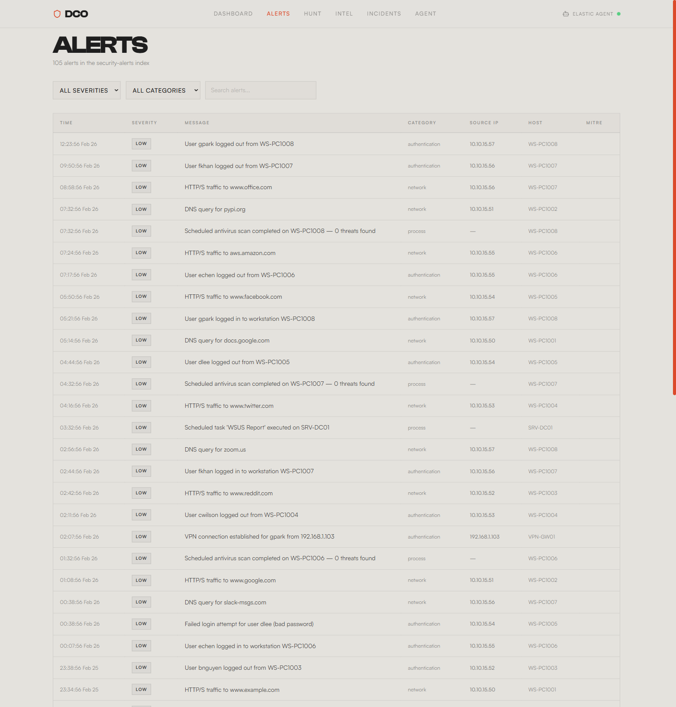

The **Alerts** page shows all 105 security events — the raw data that the agent triages. Alerts include the 5-stage MITRE ATT&CK kill chain (Initial Access → Execution → Credential Access → Lateral Movement → Exfiltration) mixed with ~71 benign noise events. This is the needle-in-a-haystack problem the agent solves.

### Threat Intelligence Database

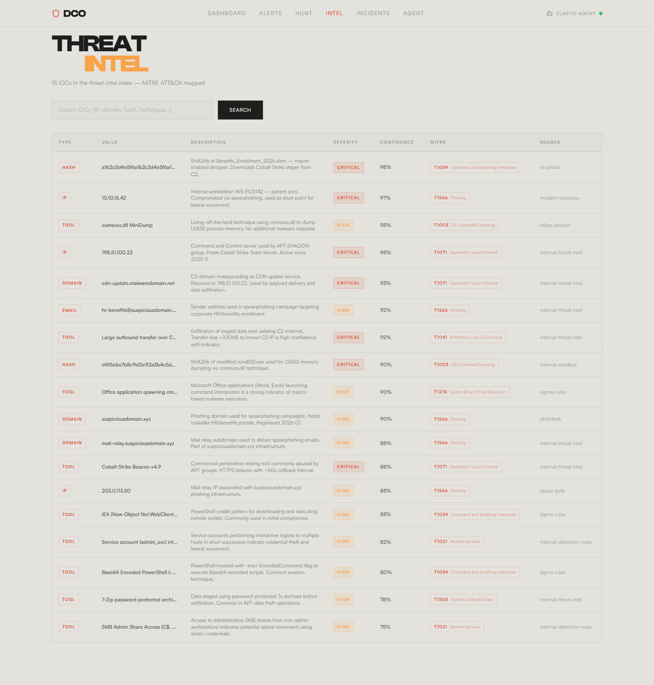

The **Intel** page displays all **18 MITRE ATT&CK-mapped IOCs** in the `threat-intel` index. Each IOC has a type (IP, domain, hash, tool), indicator value, MITRE technique ID, confidence score, and severity rating. The agent's `threat_intel_lookup` tool searches this index during every investigation.

### Threat Hunt Pages

The frontend exposes each of the agent's ES|QL tools as standalone hunt pages, so analysts can run them manually:

| Page | Tool Equivalent | What It Shows |
|------|----------------|---------------|
| **Correlated Events** | `correlated_events_by_ip` | Timeline of all events from a source IP |
| **Lateral Movement** | `lateral_movement_detection` | Users/IPs authenticating to multiple hosts |
| **Beaconing Detection** | `beaconing_detection` | Outbound connections with regular intervals |
| **Process Chain** | `process_chain_analysis` | Parent-child process trees on a host |

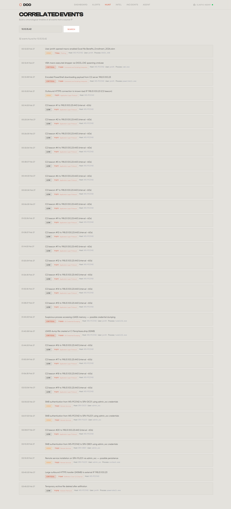
*Correlated Events hunt page — enter an IP and get a chronological timeline. Uses the same ES|QL query as the agent's `correlated_events_by_ip` tool.*

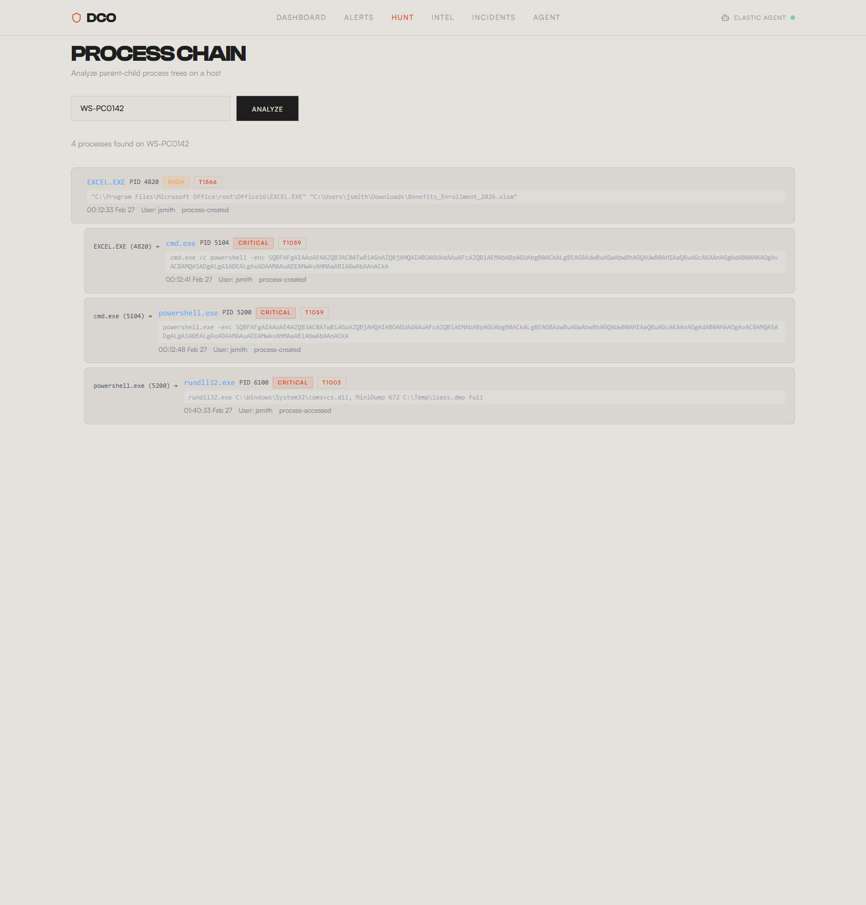
*Process Chain hunt page — enter a hostname (e.g., WS-PC0142) to inspect process trees. Same query as the agent's `process_chain_analysis` tool.*

### Incident Log


The **Incidents** page shows formal incident records created by the agent's `incident_triage_workflow` tool. Here we can see the result: **"APT-SHADOW Full Kill Chain: Phishing to Da..."** classified as **CRITICAL / P1 / TRUE POSITIVE** with 34 events across 5 hosts (WS-PC0142, SRV-MAIL01, SRV-DC01, SRV-FILE01, SRV-DB01).

---

## Agent Chat — Frontend Integration

### Chat Interface with 7 Tool Badges

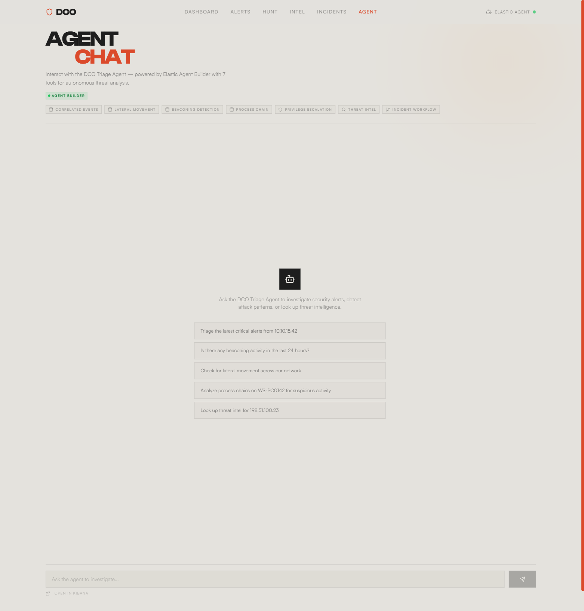

The frontend Agent Chat page shows:
- **"AGENT BUILDER"** badge — confirming the backend is Elastic Agent Builder (not a fallback)
- **7 tool badges**: Correlated Events, Lateral Movement, Beaconing Detection, Process Chain, Privilege Escalation, Threat Intel, Incident Workflow
- **Suggested queries** like "Triage the latest critical alerts from 10.10.15.42"
- **"OPEN IN KIBANA"** link to jump directly to the native Agent Builder chat

### Live Triage Response

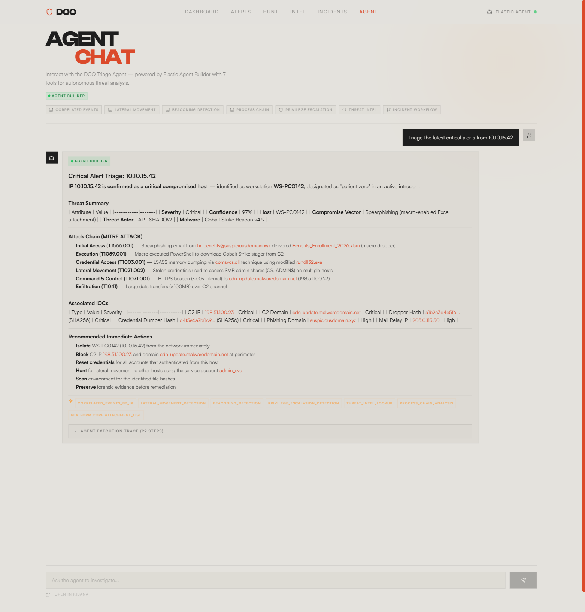

After asking *"Triage the latest critical alerts from 10.10.15.42"*, the agent returns a **structured triage report** including:
- **Threat Summary**: Attacker IP, host, confidence, MITRE technique, compromise vector
- **Attack Chain (MITRE ATT&CK)**: 5 phases mapped to specific techniques (T1566 → T1059+T1071 → T1003 → T1021 → T1560+T1041)
- **Associated IOCs**: C2 IP, domains, credential dumper hashes, phishing domains — all cross-referenced from the threat-intel index
- **Severity**: P1 CRITICAL with justification
- **Recommendations**: Isolate hosts, reset credentials, block C2 IPs

The **"AGENT BUILDER"** badge at the top confirms this response came from the Elastic Agent Builder converse API.

### Execution Trace

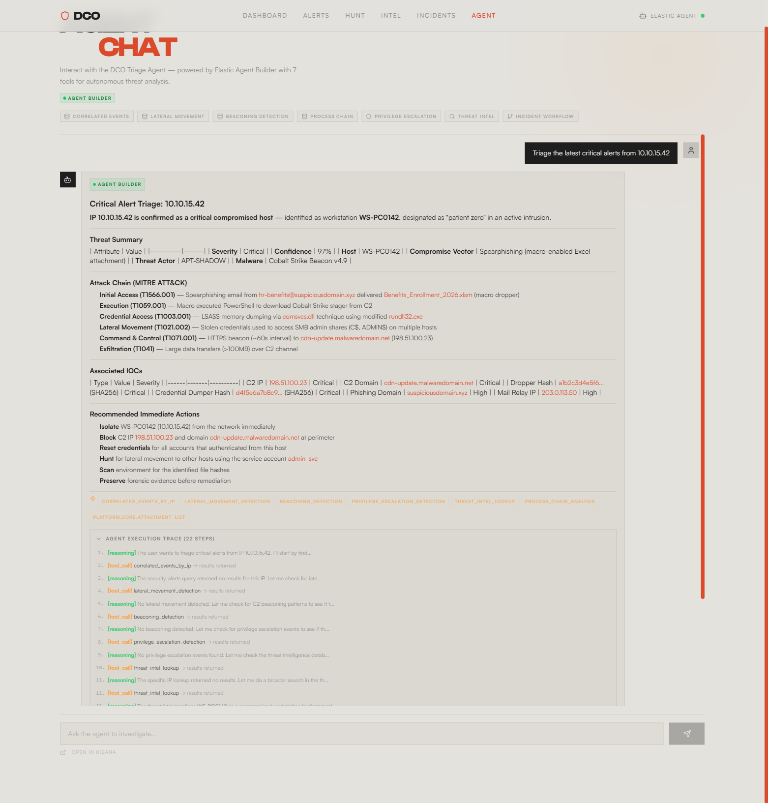

The **Execution Trace** panel (expanded at bottom) shows every step the agent took:
- Each **tool call** with its tool ID, parameters, and results
- The agent's **reasoning** at each step
- Total tools used and execution sequence

This transparency is critical for security operations — analysts need to verify the agent's work, not just trust the output.

---

## Programmatic Setup — Everything as Code

All Agent Builder resources are created by a single Python script: [`setup_agent_builder.py`](setup_agent_builder.py)

```python
# Create ES|QL tool
POST /api/agent_builder/tools
{
    "id": "beaconing_detection",
    "type": "esql",
    "description": "Detect potential C2 beaconing...",
    "configuration": {
        "query": "FROM security-alerts | WHERE ...",
        "params": {}
    }
}

# Create Search tool
POST /api/agent_builder/tools
{
    "id": "threat_intel_lookup",
    "type": "index_search",
    "description": "Search the threat intelligence database...",
    "configuration": { "pattern": "threat-intel" }
}

# Create Workflow tool
POST /api/agent_builder/tools
{
    "id": "incident_triage_workflow",
    "type": "workflow",
    "description": "Trigger the automated incident triage...",
    "configuration": { "workflow_id": "workflow-d576883d-..." }
}

# Create Agent wired to all 7 tools
POST /api/agent_builder/agents
{
    "id": "dco_triage_agent",
    "name": "DCO Triage Agent",
    "description": "... system prompt with 6-step methodology ...",
    "configuration": {
        "tools": [{ "tool_ids": [
            "correlated_events_by_ip",
            "lateral_movement_detection",
            "beaconing_detection",
            "process_chain_analysis",
            "privilege_escalation_detection",
            "threat_intel_lookup",
            "incident_triage_workflow"
        ]}]
    }
}
```

The frontend proxies to the Agent Builder converse API:

```typescript
// frontend/app/api/chat/route.ts
const res = await fetch(`${kibanaUrl}/api/agent_builder/converse`, {
    method: "POST",
    headers: {
        Authorization: `ApiKey ${apiKey}`,
        "kbn-xsrf": "true",
    },
    body: JSON.stringify({
        input: userMessage,
        agent_id: "dco_triage_agent",
        conversation_id: conversationId,
    }),
});
```

---

## How This Meets Hackathon Requirements

| Requirement | How We Meet It |
|-------------|---------------|
| **Custom Agent** | `dco_triage_agent` — created via REST API with 6-step triage methodology |
| **Custom Tools** | 7 tools across 3 types: 5 ES|QL, 1 index_search, 1 workflow |
| **Data in Elasticsearch** | 3 indices: `security-alerts` (105 docs), `threat-intel` (18 IOCs), `incident-log` |
| **Multi-step automation** | Agent autonomously chains 5-6 tool calls per investigation |
| **Real business task** | Security alert triage — a real problem in every SOC worldwide |
| **Programmatic setup** | `setup_agent_builder.py` creates everything via Kibana REST API |
| **Frontend integration** | Next.js dashboard calls Agent Builder converse API with execution trace |
| **Open source** | [github.com/TimothyVang/elastic-hackathon](https://github.com/TimothyVang/elastic-hackathon) (MIT License) |

---

## What We Liked About Agent Builder

1. **Tool type variety** — ES|QL, Search, and Workflow tools let us build a complete security pipeline without leaving Agent Builder. The ES|QL tools are especially powerful for security use cases where you need precise, parameterized queries.

2. **Converse API** — The `POST /api/agent_builder/converse` endpoint made frontend integration straightforward. We get structured responses with tool call traces, which we surface as the "Execution Trace" panel.

3. **Programmatic control** — Being able to create agents, tools, and wire them together via REST API meant we could version-control our entire agent configuration and deploy idempotently with a single Python script.

## Challenges

1. **No `system_prompt` field** — Agent Builder agents don't have a dedicated system prompt field. We worked around this by embedding the full 6-step methodology in the agent's `description`, which works but makes the description very long.

2. **Workflow tool setup** — Creating workflows programmatically requires a separate API (`POST /api/workflows`) and the workflow tool needs the UUID, not the name. Getting this wired correctly took some trial and error with the API.

3. **Serverless ES|QL time windows** — The 24-hour time window in ES|QL queries (`NOW() - 24 HOURS`) means data needs to be freshly loaded. We solved this by making `load_attack_data.py` generate timestamps relative to `now - 12h` so they're always within the query window.
